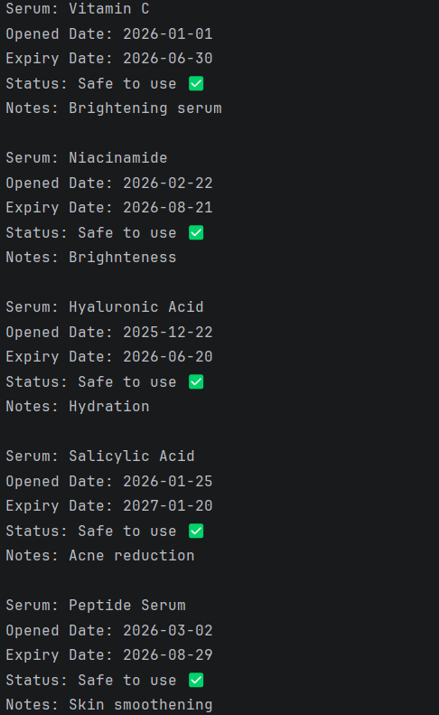

# Serum Expiry Tracker (Python)

## 📌 Project Overview

The **Serum Expiry Tracker** is a Python-based application designed to help users track skincare serums and determine whether they are still safe to use after opening. Many skincare products have a limited shelf life once opened (for example, 6 or 12 months).

This project allows users to store serum information and automatically calculate the expiry date using Python's datetime logic.

---

## ❗ Problem Statement

Users often forget when they opened skincare products. Using expired serums can reduce effectiveness and sometimes cause skin irritation.

This project provides a simple tracking system that records the opening date of a serum and automatically determines whether the product is **Safe to Use** or **Expired**.

---

## ⚙️ Methodology

The application follows a simple workflow:

1. The user enters serum details:

   * Serum name
   * Opened date
   * Usability duration (in months)
   * Notes

2. The system calculates the expiry date using Python's **datetime module**.

3. All serum data is stored in a **CSV file**.

4. The program compares the expiry date with today's date.

5. The system outputs whether the serum is:

   * ✅ Safe to use
   * ❌ Expired

---

## 🧠 Model / Logic Used

Instead of a machine learning model, this project uses **rule-based logic**.

Expiry Date Calculation:

Opened Date + (Months × 30 days)

The program then compares the expiry date with the current date to determine the serum status.

---

## 📊 Model Evaluation

The program was tested with multiple serum entries with different opening dates and expiry periods.

Evaluation results showed:

* Accurate expiry date calculation
* Correct classification of serum status (Safe / Expired)
* Successful storage and retrieval of serum records using CSV.

---

## 🛠 Technologies Used

* Python
* CSV File Handling
* Datetime Module

---

## 📂 Project Files

* `serum_tracker.py` → Main Python program
* `serum_data.csv` → Dataset storing serum information
* `output.png` → Screenshot of program output

---

## 📷 Output

---

## 📚 Key Learnings

Through this project I learned:

* Python file handling using CSV
* Working with date calculations using the datetime module
* Building a menu-driven Python application
* Structuring a project repository on GitHub
* Documenting projects using Markdown

---

## 🚀 Future Improvements

Possible improvements include:

* Building a GUI version using **Tkinter**
* Adding **expiry notifications**
* Creating a **mobile version of the tracker**
* Adding **data visualization for serum usage trends**
